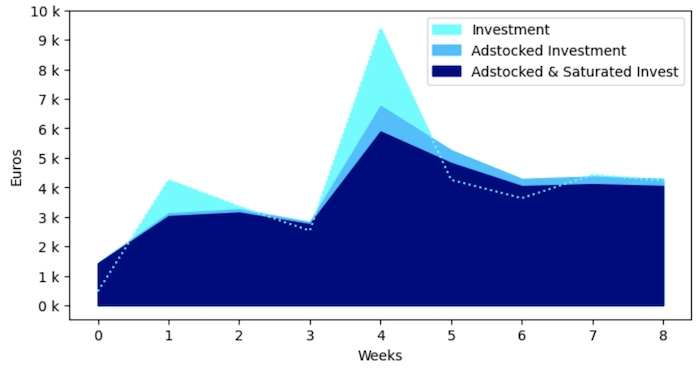
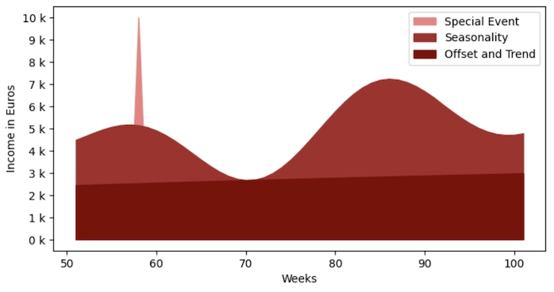
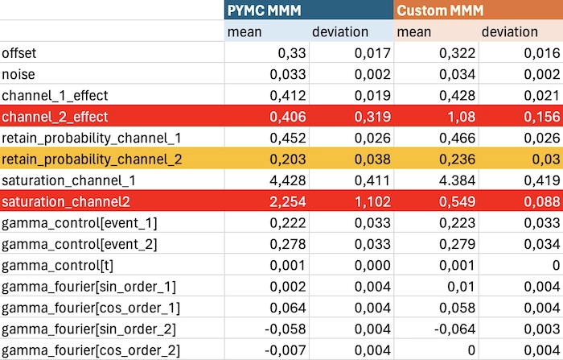
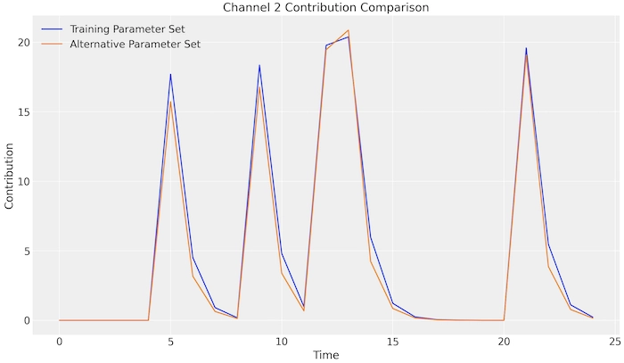

Let's create a tailored mixed marketing model that matches the performance of the official PYMC Marketing Solution, as demonstrated in the official [MMM Example Notebook](https://www.pymc-marketing.io/en/stable/notebooks/mmm/mmm_example.html).


[comment]: <> (# I developed a custom Mixed Marketing Model that is comparable to a professional Solution)

*By the end of this project story, you'll not only learn how to create custom components for channel adstock, saturation, and seasonality effects in mixed marketing models, but you'll also gain insights into potential model pitfalls.*

## *Accompanying Colab Jupyter Notebook*
*I have compiled all the essential code in a [Comprehensive Project Notebook](https://colab.research.google.com/drive/1Z8XW-CXhFTlKekWu_Pi7ghVGIaPHEvWb?usp=sharing), covering everything from test data generation to the implementation of our components and models. This notebook facilitates a direct comparison between our solution and the PYMC example. Please note that the variable names in the notebook align with those in the PYMC MMM Example Notebook and not with the names we use here. This makes it easier to compare both solutions   .*

***

## About Mixed Marketing Solutions

Mixed marketing models enable you to evaluate the effectiveness of your marketing channels like Facebook ads in relation to your email campaigns, without the need to identify who exactly saw or clicked on them. This is particularly beneficial in the era of stringent data protection laws and increasing concerns over consumer privacy. The success of these models lies in their ability to combine advanced machine-learning techniques with expert knowledge from the domain. This integration allows for more accurate and efficient marketing strategies tailored to current trends and consumer behavior.

## About PYMC and its Marketing Solution

PYMC is a powerful marketing analytics tool, developed by top professionals in the field. It uses Bayesian statistical methods to help businesses make smarter, data-driven decisions. Its creators, experts in both statistics and marketing, ensure PYMC is a practical, real-world solution for today’s marketing challenges. With PYMC, companies can gain precise insights, efficiently adapting to market trends and data privacy changes.

***

# Table of Contents

- [Why make your own solution, if a solution already exists?](#why-make-your-own-solution-if-a-solution-already-exists)
- [What Model Aspects Do We Create?](#what-model-aspects-do-we-create)
  - [Model Parts for the Media Channel Impact](#model-parts-for-the-media-channel-impact)
  - [Model Parts for Modeling the Rest of the World](#model-parts-for-modeling-the-rest-of-the-world)
- [How to Implement the Four Major Model Aspects](#how-to-implement-the-four-major-model-aspects)
  - [Create the Adstock with Convolution](#create-the-adstock-with-convolution)
  - [Saturate with a Simple Logarithmic Formula](#saturate-with-a-simple-logarithmic-formula)
  - [Build Seasonality with Fourier Decomposition](#build-seasonality-with-fourier-decomposition)
  - [Events and Trend as Weighted Control Variables](#events-and-trend-as-weighted-control-variables)
- [Let's Plug Everything Together: The Final Model](#lets-plug-everything-together-the-final-model)
- [How Does Our Solution Compare to the PYMC Marketing Solution?](#how-does-our-solution-compare-to-the-pymc-marketing-solution)
  - [The Comparison Table for Our Parameters](#comparing-our-model-with-the-pymc-model)
  - [Why Our Channel 2 Parameters are Correct too](#why-our-channel-2-parameters-are-correct-too)
  - [How to Fix This Problem?](#how-to-fix-this-problem)
- [Final Summary: Insights and Implications](#final-summary-insights-and-implications)
- [Resources](#resources)


# Why make your own solution, if a solution already exists?

While the PYMC Marketing Solution is a robust boilerplate tool, there are three key advantages to developing our own custom mixed marketing model (MMM) components:

1. **Flexibility and Adaptability**: Tailoring our approach to address specific business challenges.
2. **Versatility**: Creating generic solutions applicable to other domains, such as resource planning.
3. **Skill Enhancement**: Advancing our expertise in Bayesian modeling.

The objective of this project is to go beyond the standard Delayed Saturated Mixed Marketing Model provided by PYMC. We aim to craft bespoke components using basic PYMC models, focusing on:

1. **Adstock Scattering**: We’ll explore this by convoluting distribution shapes and learning their parameters.
2. **Seasonality**: Implementing Fourier decomposition to model varying trends (yearly, monthly, etc.).
3. **Channel Saturation**: Simplifying logistic saturation effects.

# What Model Aspects do we Create?

We aim to replicate all facets of the Delayed Saturated Mixed Marketing Model (MMM) as outlined in the MMM Example Notebook. This includes modeling the impact of media channels as well as the influence of external factors.

## Model Parts for the Media Channel Impact

- **Formula**: `channel_effectiveness * saturation(adstock(marketing_cost))`
  - **Channel Effectiveness**: This measures the return on investment for each marketing dollar spent. It's a crucial metric that aids in comparing the effectiveness of different channels.
  - **Saturation**: This concept asks how much investment a channel can absorb before it becomes ineffective. For example, purchasing all advertisement slots on a TV channel (say, 56 slots) doesn't mean you will achieve 56 times the impact of buying just one slot. The channel reaches a point of saturation where additional investment yields diminishing returns. 
  - **Adstock**: This term refers to the time it takes for your marketing spend to show its full effect. For instance, spending $10,000 on an influencer marketing video won't yield immediate results. The total advertising effect will accumulate over several days, based on when the video is most viewed. 

*** 

*Initial Invest gets stretched out by adstock and reduced by saturation*
*** 


## Model Parts for Modeling the rest of the world

- **Formula**: `offset + trend + yearly_seasonality + special_events + background_noise`
  - **Offset**: This represents baseline sales without any advertising.
  - **Trend**: This factor accounts for future sales projections based on underlying growth trends.
  - **Yearly Seasonality**: This aspect examines whether there are specific times of the year when your product performs better.
  - **Special Events**: These are unique events that significantly impact sales but are too irregular to model continuously, such as Black Friday.

*** 
  
  *Weekly income over a year as a sum of offset + trend + seasonlity + one special event*
***
   
Each of these components will be integrated into our model. Some, like offset, are straightforward, while others, like adstock, are more complex and demand intricate coding.

# How to implement the four major model aspects

## Create the Adstock with Convolution

Convolution is a key method for analyzing data. It helps understand how your advertising affects sales over time. Think of it like mixing your ad spending (how much you spend on ads each day) with a special pattern (called a geometric distribution) to see how long your ads keep working. In this pattern, the model learns the 'retention rate' from your data, a flexible part of the pattern. It helps figure out how quickly the power of your ads fades. This method gives us a clearer picture of when and how your ads impact sales.

### About PyTensor

We use PyTensor for our solution, as it's the underlying library in Vanilla PYMC which we use for creating components. PyTensor is an open-source machine learning library, similar to TensorFlow and Pyro, designed to provide a flexible platform for artificial intelligence research and development. In fact, there is not much choice for us - we have to implement our solution in PyTensor, since only then the PYMC can make sense of it and use it in context of its sampling algorithms.

Here is the code we will use:

```python
def convolve_distribution_1d(media_cost, distribution, length):

    media_cost = pt.as_tensor_variable(media_cost)

    dist_pdf = pt.exp(pm.logp(distribution, pt.arange(1, length + 1)))
    dist_pdf_normalized = dist_pdf / pt.sum(dist_pdf)

    convolved = conv.conv2d(input=media_cost[np.newaxis, np.newaxis, :, np.newaxis],
                            filters=dist_pdf_normalized[np.newaxis, np.newaxis, :, np.newaxis],
                            border_mode='full')

    return convolved[0, 0, :-length + 1].T[0]
```

### Code Explanation:

 1. Function Definition: `convolve_distribution_1d(media_cost, distribution, length)`
    - `media_cost`: Represents the amount spent on advertising over time.
    - `distribution`: The geometric distribution used in the adstock model.
    - `length`: The duration over which the adstock effect is considered.
 2. Preparing Media Cost Data:
    - `media_cost = pt.as_tensor_variable(x)`: Converts the media cost data into a PyTensor tensor, making it compatible with PyTensor operations.
 3. Creating the Distribution PDF:
    - `dist_pdf = pt.exp(pm.logp(distribution, pt.arange(1, length + 1, 1)))`: This step calculates the probability density function (PDF) of the geometric distribution for each time step. The use of pm.logp followed by pt.exp is a numerical stability technique. Computing the log probability and then exponentiating it helps to avoid numerical issues related to small probability values, ensuring more accurate and stable calculations.
 4. Performing Convolution:
    - `convolved = conv.conv2d(...)`: This line performs the 2D convolution operation, which is a bit complex because it's originally designed for 2D data like images. Here, we adapt it for our 1D case by reshaping our media cost and distribution PDF. The input parameter represents the media cost, and the filters parameter is the normalized distribution PDF, both reshaped to fit a 2D structure. `border_mode='full'` ensures comprehensive convolution, considering the entire data range. This adaptation from 2D to 1D is necessary because convolution functions in libraries like PyTensor are optimized for multi-dimensional data, requiring us to format our 1D data accordingly.
 5. Extracting and Returning the Result:
    - `return convolved[0, 0, :-length + 1].T[0]`: This extracts the convolved data and formats it into the desired output, trimming extra padding to match the input size of the media cost data.

In summary, this function applies convolution to ad spending and a geometric distribution to model the cumulative effect of advertising over time. The use of 2D convolution for a 1D problem is a workaround, utilizing the powerful capabilities of PyTensor designed for more complex scenarios. This results in an accurate representation of the adstock effect, essential for marketing analysis.


## Saturate with a Simple Logarithmic Formula
In our approach, we replicate the logistic saturation used in the MMM Example Notebook with a customized logistic function:
python

```python
logistic_saturation = lambda lam, x: (1 / (1 + np.exp(-lam * x)) - 0.5) * 2
```


This function represents a modified logistic curve where lam acts as a decay factor influencing the rate of saturation. Let's make sense of this formula:

 1. `Centered and Scaled`: The standard logistic function typically ranges from 0 to 1 and is centered around 0.5. However, in marketing models like ours, it's useful to have a function centered at 0 for easier interpretation and comparison. By subtracting 0.5 and then multiplying by 2, we re-center the curve around 0 and scale it to range from -1 to +1. This adjustment aligns better with how marketing data is often analyzed and compared.
 2. `Interpreting Lam`: The 'lam' parameter controls the curve's steepness. In marketing, it determines how fast marketing impact reaches diminishing returns. A higher value of lam means quicker saturation - meaning that additional marketing efforts will have less impact sooner. This is the parameter we will learn.
 3. `Application in Marketing`: Such a saturation model is crucial in understanding the effectiveness of marketing campaigns. It helps in identifying the point at which additional spending on a particular marketing channel (e.g., online ads or TV commercials) becomes less effective, ensuring that budgets are allocated efficiently.

In essence, this simple yet effective logistic saturation function provides a clear, quantifiable measure of how marketing efforts saturate over time and is an essential component of comprehensive marketing mix modeling.


## Build Seasonality with Fourier Decomposition

Fourier decomposition is a sophisticated method used to break down complex signals into simpler components. In the context of our mixed marketing model, we employ it to model seasonal trends that influence consumer behavior and sales. This approach allows us to identify and quantify patterns that recur over regular intervals, such as weekly, monthly, or annually, which are crucial in understanding and predicting sales fluctuations.

This method of capturing seasonality was popularized and effectively utilized by Facebook's Prophet forecasting tool, a prominent solution in the field of time series analysis. Prophet leverages Fourier decomposition to handle complex seasonal patterns with ease, making it a benchmark in the industry. The underlying principles and efficiency of this method are detailed in Facebook's research publications.

Incorporating Fourier decomposition into our model adds a layer of precision, enabling us to dissect and understand the periodic aspects of sales data. By accurately modeling these seasonal trends, we can better adapt marketing strategies to align with consumer behavior, leading to more targeted and effective campaigns

Thats the code we will use:

```python
def fourier_series(time, period, harmonics):

    x = pt.arange(time).dimshuffle('x', 0)

    frequencies = 2 * np.pi * pt.arange(1, harmonics + 1) / period

    cos_part = pt.cos(frequencies[:, None] * x)
    sin_part = pt.sin(frequencies[:, None] * x)

    return pt.concatenate([sin_part, cos_part], axis=0)

def fourier_model(name, time, period, harmonics):

    fourier_terms = fourier_series(time, period, harmonics)

    weights = pm.Normal(f'weights-{name}', mu=0, sigma=1, shape=(harmonics*2, 1))
    trend = pt.sum(fourier_terms * weights, axis=0)

    return trend
```

### Code Explanation:

The provided code snippets define two functions for implementing Fourier decomposition in a mixed marketing model, handling different seasonal trends.

 1. Function fourier_series: The base decomposition
    - `x = pt.arange(time).dimshuffle('x', 0)`: Creates a time array and reshapes it for broadcasting, allowing operations with other arrays of different shapes.
    - `frequencies = 2 * np.pi * pt.arange(1, harmonics + 1) / period`: Calculates the fundamental frequencies for the given period and harmonics.
    - `cos_part and sin_part`: Compute the cosine and sine components of the Fourier series for each frequency.
    - `return pt.concatenate([sin_part, cos_part], axis=0)`: Combines the sine and cosine parts into a single array, forming the complete Fourier series.
 2. Function fourier_model: The frame that allows for different trends to be trained
    - `fourier_terms = fourier_series(time, period, harmonics)`: Calls the fourier_series function to get the Fourier components.
    - `weights = pm.Normal(...)`: Defines a set of weights as normal distributions, one for each Fourier term. The model adjusts these weights, which are learnable parameters, during training.
    - `trend = pt.sum(fourier_terms * weights, axis=0)`: Calculates the weighted sum of the Fourier terms to generate the final trend. This represents the model's estimate of the seasonal effect.

In essence, these functions collectively allow the model to capture and adapt to various seasonal patterns in the data by learning the appropriate weights for each harmonic in the Fourier series. This approach is flexible and powerful for modeling complex, repetitive patterns in time-series data, such as sales trends influenced by seasonality.

## Events and Trend as weighted control variables


In our model, events and trends are captured through weighted control variables. The weights are learned by the model, with each variable represented as a list corresponding to the time series length. 

For events, the list contains zeros with a '1' marking the occurrence of an event. This binary approach efficiently flags significant occurrences.
```python
event_weight * [0,0,0,1,0,0,0,0,0,0]
```
The trend is modeled as an incremental series from 1 to the number of time slots, reflecting the passage of time and capturing underlying growth patterns. 
```python
trend_weight * [0,1,2,3,4,5,6,7,8,9]
```
This method allows the model to dynamically adjust and understand the impact of time-specific events and ongoing trends on marketing outcomes.

<add example>

# Let's plug everything together: The final model 

Finally we can create our custom mixed media marketing model with custom components, that we can easily extend and reuse for whatever other use case we have in mind.


```python
time_series_length = 179

with pm.Model() as mixed_marketing_model:

    ## world impact
    offset = pm.Normal('offset', sigma=2)

    # control variables
    weight_trend = pm.Normal('weight_trend', sigma=2)
    weight_event_1 = pm.Normal('weight_event_1', sigma=2)
    weight_event_2 = pm.Normal('weight_event_2', sigma=2)

    # yearly trend on time series at the granularity of weeks
    seasonality = fourier_model('seasonality', time_series_length, 365.5/7, 2)

    ## world impact
    saturation_channel_1 = pm.Gamma('saturation_channel_1', alpha=3, beta=1)
    saturation_channel_2 = pm.Gamma('saturation_channel_2', alpha=3, beta=1)

    # adstock based on geometric distribution
    retention_rate_channel_1 = pm.Beta('retention_rate_channel_1', alpha=3, beta=1)
    distribution_channel_1 = pm.Geometric.dist(retention_rate_channel_1)
    adstocked_channel_1 = convolve_distribution_1d(data['marketing_cost_channel_1'], distribution_channel_1, 8)

    retention_rate_channel_2 = pm.Beta('retention_rate_channel_2', alpha=3, beta=1)
    distribution_channel_2 = pm.Geometric.dist(retention_rate_channel_2)
    adstocked_channel_2 = convolve_distribution_1d(data['marketing_cost_channel_2'], distribution_channel_2, 8)

    channel_1_effect = pm.LogNormal('channel_1_effect', mu=0.5, sigma=0.7)
    channel_2_effect = pm.LogNormal('channel_2_effect', mu=0.25, sigma=0.3)

    # combine the parts
    marketing_impact = ( offset
    + weight_trend * range(time_series_length)
    + weight_event_1 * [1 if i == 58 else 0 for i in range(time_series_length)]
    + weight_event_2 * [1 if i == 128 else 0 for i in range(time_series_length)]
    + seasonality
    + channel_1_effect * logistic_saturation(saturation_channel_1, adstocked_channel_1 )
    + channel_2_effect * logistic_saturation(saturation_channel_2, adstocked_channel_2 )
    )

    # whatever else is out there
    noise = pm.HalfNormal('noise', sigma=0.1)

    obs = pm.Normal('obs', mu=marketing_impact, sigma=noise, observed=data['sales'] )
```

### Code Explanation

In our journey to build a sophisticated mixed marketing model using PYMC, we've reached the crucial stage of integrating various complex components. This integration is key to analyzing and understanding the multifaceted dynamics of marketing strategies.

 1. Establishing the Baseline - The World Impact:
    - `offset = pm.Normal('offset', sigma=2)`: We start by setting a baseline, `offset`, which represents the basic level of sales or impact without any marketing intervention. As all other distributions, its' based with scaled data in mind.
 2. Incorporating Control Variables:
    - `weight_trend, weight_event_1, weight_event_2`: These Normal distributions represent the weights or importance of different control variables like overall market trends and specific events. They allow the model to adjust for external factors that can influence marketing effectiveness.
 3. Capturing Seasonal Trends:
    - `seasonality = fourier_model(...)`: Here, we use Fourier decomposition to model complex seasonal patterns in sales or marketing response. This component breaks down time series data into cyclical components, allowing us to account for regular fluctuations like seasonal buying habits.
 4. Modeling Channel-specific Dynamics:
    - `saturation_channel_1 and saturation_channel_2`: These Gamma distributions model the saturation point for each marketing channel - a point beyond which additional spending yields diminishing returns.
    - `retention_rate_channel_1 and retention_rate_channel_2`: The Beta distributions here represent the likelihood of retaining the marketing impact over time for each channel.
    - `adstocked_channel_1 and adstocked_channel_2`: Using the convolve_distribution_1d function, we apply the concept of adstock to model how the effect of marketing spend accumulates and fades over time.
 5. Quantifying Channel Effects:
    - `channel_1_effect, channel_2_effect`: These LogNormal distributions estimate the effectiveness of each marketing channel. It's a measure of how much impact each dollar spent on a channel has on sales or consumer response.
 6. Combining the Components:
    - The `marketing_impact` calculation combines all these elements into a cohesive model. It accounts for base sales, trends, event impacts, seasonal variations, and the effects of marketing channels, both in terms of their saturation and adstock.
 7. Accounting for Unexplained Variability:
    - `noise = pm.HalfNormal('noise', sigma=0.1)`: This represents the unexplained variability or the 'noise' in the data, acknowledging that not all factors can be captured in the model.
 8. Observational Data Integration:
    - `obs = pm.Normal(...)`: Finally, we tie our model to real-world data by observing the actual sales figures. This step is crucial for training the model, allowing it to learn from actual market responses.

In essence, this model is a comprehensive blend of statistical techniques and marketing theory, designed to dissect and understand the nuanced interplay of various marketing elements. 

# How Does Our Solution Compare to the PYMC Marketing Solution?
It's time to reap the fruits of our labor! Let's explore how our custom, homemade solution stacks up against the professional solution crafted by the PYMC Team. In summary, our solution is nearly as effective, albeit with a slightly slower execution time and a notable difference in the learned parameters for channel 2. Intriguingly, this variance was pre-existing in the official PYMC MMM Example Notebook, and our investigation has brought it to light.

## Comparing Our Model with the PYMC Model
We compared the PYMC Delayed Saturated MMM Model with our own custom model, using the same data for both. In probabilistic programming, it's hard to get exactly the same results every time because of random effects. But, our tests shows that our model learned the parameters almost as well as the PYMC model. The only big difference are the parameters for channel 2.

***

*Most parameters are very much the same in size and variance. But there is a problem with the channel 2 parameters for channel effect and saturation*
***

## Why Our Channel 2 Parameters are Correct too
We found something interesting in the PYMC MMM Example Notebook. There are two different sets of parameters that give almost the same results for channel 2. Here’s what they look like:

**Parameters from the Official Notebook for Channel 2:**
- Channel Effect: 3 (before scaling)
- Retention Rate: 0.2
- Saturation Point: 3

**Parameters from Our Model:**  
- Channel Effect: 12.5 (before scaling) - That's a lot more!
- Retention Rate: 0.2
- Saturation Point: 0.5

***

*Even though these numbers are different, when we used them in the model, the results for channel 2 were almost the same, but for channel 2 parameters.* 
***

## How to Fix This Problem?     

To avoid wrong estimates about channel contributions, we could:

1. **Adjust Saturation Point for Channel 2**: We implement an offset of 1 to the saturation point. This adjustment is based on the nature of our custom logistic saturation function. In our model, logistic saturation is defined as `logistic_saturation_custom = lambda lam, x: (1 / (1 + np.e**-(lam * x)) - 0.5) * 2`. Given this formula, a saturation value less than 1 would counterintuitively lead to an increase rather than a decrease in the output, contradicting the typical behavior of saturation in marketing contexts. By ensuring the saturation point does not fall below 1, we maintain the expected behavior where increased investment leads to diminishing returns, aligning with standard marketing principles.

```python
    saturation_channel_2 = 1+pm.Gamma('saturation_channel_2', alpha=3, beta=1)
```

2. **Modify Channel Effect Distribution**: We switch from a LogNormal to a Normal distribution for modeling the channel effect of channel 2. The Normal distribution is less likely to produce extreme values, which helps in preventing the model from learning unrealistic parameter values, especially in scenarios where data might be noisy or sparse.

```python
    channel_2_effect =  pm.Normal('channel_2_effect', mu=0.25, sigma=0.3)
```

Also, doing a detailed check before starting the model can help spot these kinds of issues, especially when the data is a bit noisy.

# Final Summary: Insights and Implications
As we conclude our exploration of building a custom mixed marketing model (MMM), it’s evident that our efforts have not only mirrored the efficacy of the PYMC Marketing Solution but also provided additional insights. Here are the major takeaways:

**Custom Component Creation**: The project successfully demonstrated the development of custom components for channel adstock, saturation, and seasonality effects in MMMs. This not only serves as a practical guide for similar endeavors but also enhances our understanding of MMM complexities.

**Performance Comparison**: Our model, though slightly slower in execution, matches closely with the official PYMC Marketing Solution in terms of performance. This parity underscores the potential of custom-built solutions in achieving professional-grade results.

**Parameter Variance Discovery**: A notable outcome is the identification of variance in the parameters for channel 2, a detail that was not immediately apparent in the PYMC model. This discovery emphasizes the importance of rigorous testing and validation in probabilistic modeling.

**Model Flexibility and Adaptability**: The project highlights the flexibility of custom models in adapting to specific business needs and contexts. This adaptability is crucial in a rapidly changing marketing landscape, where bespoke solutions often yield the most effective results.

**Technical Advancements**: Incorporating advanced techniques like distribution convolution and Fourier decomposition not only enriched our model but also provided tools that are transferable to other domains beyond marketing.

**Future Directions**: Looking ahead, there is ample scope for refining our model, particularly in making its components more versatile and generalizable. Further research could explore dynamic trend switch points and expanding the model's capabilities to encompass a broader range of scenarios.

In essence, this project story serves as a testament to the power of custom-built solutions in the field of marketing analytics. It underscores the value of a nuanced, component-based approach and paves the way for future innovations in Bayesian modeling and marketing strategy optimization.


# Resources
## Colab Notebooks

- [Main Project Notebook](https://colab.research.google.com/drive/1Z8XW-CXhFTlKekWu_Pi7ghVGIaPHEvWb?usp=sharing)

- [Preparation Notebook Saturated Adstock](https://colab.research.google.com/drive/1V1PWkXjbeUeStqjz2qXadYXuo1FlfK83?usp=sharing)
- [Preparation Notebook Seasonality](https://colab.research.google.com/drive/1eCIJAQtPcP9CHLa0DohMUnl8gwAbpIKz?usp=sharing)

## PYMC & PYMC Marketing Solution

- [PYMC Probabilistic Programming](https://www.pymc.io/welcome.html)
- [PYMC Marketing Solution](https://www.pymc-marketing.io/en/stable/)
- [PYMC Mixed Media Model Example Notebook](https://www.pymc-marketing.io/en/stable/notebooks/mmm/mmm_example.html)
- [Bolt using PYMC Marketing Solution](https://bolt.eu/en/blog/budgeting-with-bayesian-models-pymc-marketing/)


## Further Articles
- [A Beginners Guide to Marketing Mixed Models @ measured.com](https://www.measured.com/blog/the-beginners-guide-to-marketing-mix-modeling-mmm/)
- [Facebook Prophet Forecastng](https://facebook.github.io/prophet/)
- [Facebook Prophet Paper - Forecasting at Scale](https://peerj.com/preprints/3190.pdf)